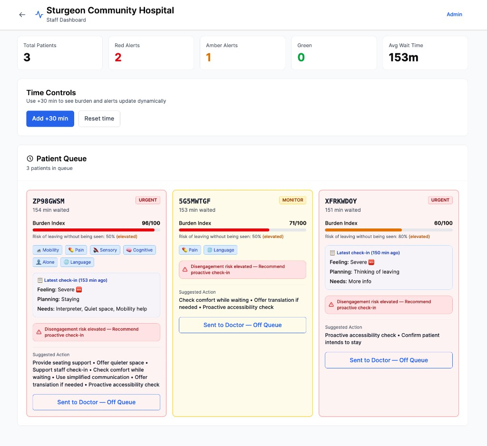
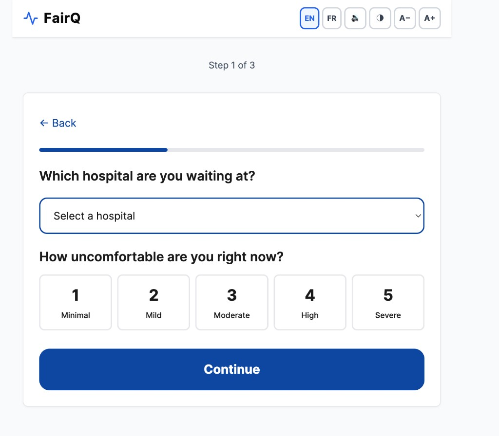
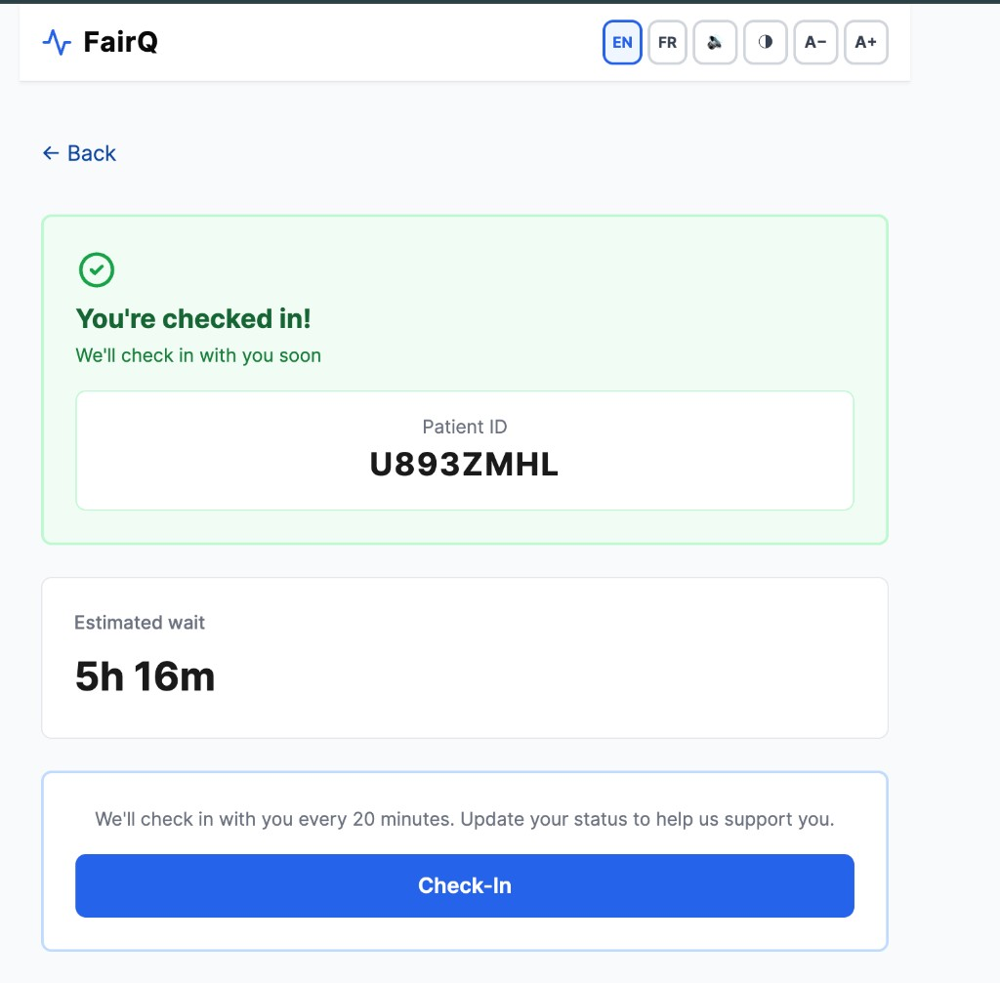
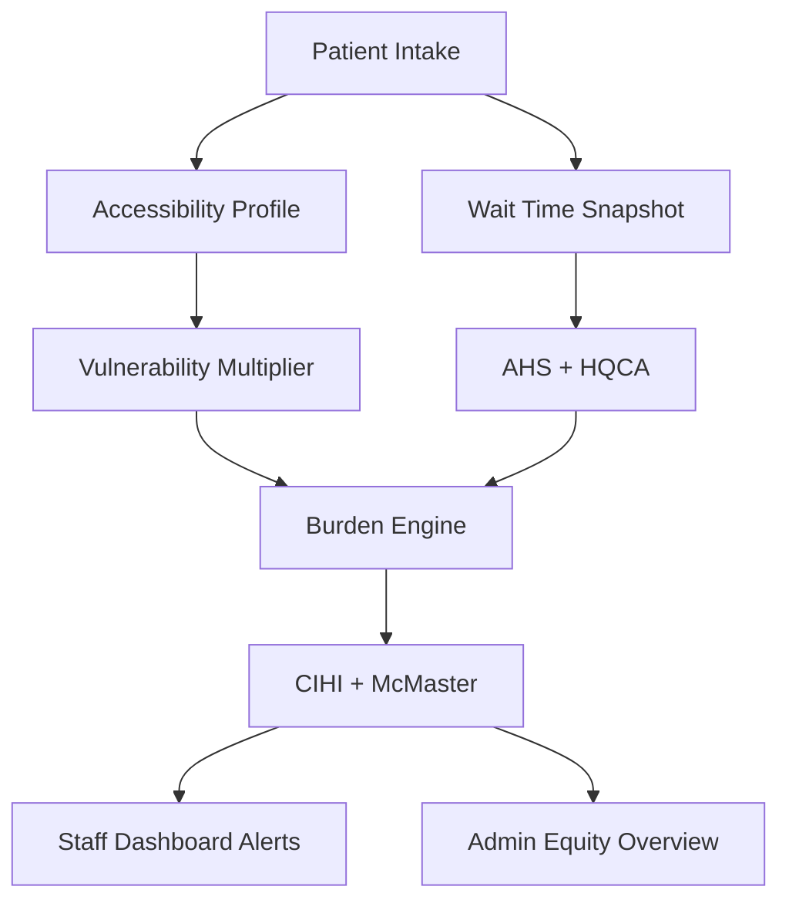

# FairQ

**Accessibility-Adjusted Emergency Room Burden Platform**

FairQ is a real-time accessibility equity layer for emergency departments. It models how ER wait times disproportionately burden patients with functional accessibility needs and provides frontline staff and administrators with actionable insights to reduce inequity — without replacing triage or making clinical decisions.

---

## 🚨 Problem

Emergency departments measure **wait time**. They do not measure **waiting burden**.

Two patients with identical wait times can experience radically different distress due to:

- Mobility impairment
- Chronic pain
- Language barriers
- Sensory sensitivity
- Being alone

This creates **invisible inequity**.

## 💡 Solution

FairQ introduces an **accessibility-adjusted burden index** that weights wait time by vulnerability. Staff see who is at elevated risk of distress or leaving without being seen (LWBS), with suggested actions to support patients equitably.

---

## 🛠 Technical Highlights

- Accessibility-weighted burden modeling engine
- Real-time burden refresh with backend simulation
- Alert threshold system (Green/Amber/Red)
- LWBS risk integration from Alberta HQCA data
- Vulnerability multiplier derived from StatsCan disability data
- Modular NestJS architecture with RESTful endpoints
- Angular SPA with route guards and session-based auth
- Dockerized full-stack deployment

---

## Screenshots

### Staff Dashboard



Queue view with burden index, LWBS risk, accessibility flags, and suggested actions per patient.

### Admin Dashboard


Model health and alert distribution.

### Equity Overview


Burden analysis by accessibility needs (mobility, pain, sensory, cognitive, language, alone).

### Patient Intake

| Step 1: Hospital & Discomfort | Step 2: Accessibility | Waiting View |
|-------------------------------|------------------------|--------------|
|  |  |  |

---

## Architecture

### Data Flow Diagram



*Patient Intake → Accessibility Profile → Vulnerability Multiplier → Wait Time Snapshot (AHS + HQCA) → Burden Engine (CIHI + McMaster) → Staff Dashboard Alerts*

---

## Project Structure

```
nomoney/
├── backend/          # NestJS API (Node.js + TypeScript)
├── frontend/         # Angular SPA
├── docker-compose.yml
├── package.json      # Monorepo scripts
└── README.md
```

### Backend (NestJS)

- **Base URL** (dev): `http://localhost:3002/api` (or `http://localhost:4200/api` via frontend proxy)

**Endpoints**:

| Module | Method | Path | Description |
|--------|--------|------|-------------|
| App | GET | `/` | Hello |
| Health | GET | `/health` | Health check |
| Client Info | GET | `/client-info` | Client IP (X-Forwarded-For) |
| Wait Times | GET | `/wait-times` | Full snapshot (hospitals, wait minutes, LWBS rates) |
| | GET | `/wait-times/facilities` | ER facilities list |
| | GET | `/wait-times/current` | Current wait times |
| | GET | `/wait-times/:hospitalKey` | Single hospital (`uofa`, `royalAlexandra`, etc.) |
| Accessibility Profiles | GET | `/accessibility-profiles/templates` | Profile templates |
| | POST | `/accessibility-profiles/compute` | Compute vulnerability multiplier |
| Burden Modeling | POST | `/burden-modeling/compute` | Burden curves, score, alert status |
| | POST | `/burden-modeling/estimated-wait` | Estimated wait minutes |
| Patients | POST | `/patients` | Register patient |
| | GET | `/patients` | All patients (optional `?hospitalKey=`) |
| | POST | `/patients/:id/checkins` | Add patient check-in |
| | POST | `/patients/:id/staff-checkin` | Record staff checked in with patient |
| | DELETE | `/patients/:id` | Remove patient (sent to doctor / off queue) |
| Check-in | POST | `/check-in` | Standalone check-in (delegates to PatientsService) |

### Frontend (Angular)

- **Base**: `http://localhost:4200`

**Routes**:

| Path | Component | Guard | Description |
|------|-----------|-------|-------------|
| `/` | Landing | — | Entry: Staff (code) or Patient |
| `/patient` | Patient | — | Patient shell (children below) |
| `/patient/intake/:step` | Intake | — | 3-step intake (context → accessibility → confirm) |
| `/patient/checkin` | Checkin | — | Check-in form (discomfort, needs, planning) |
| `/patient/waiting` | Waiting | — | Post check-in waiting view |
| `/staff` | Staff | staffGuard | Staff dashboard (queue, actions) |
| `/admin` | Admin | staffGuard | Admin dashboard (read-only) |
| `**` | — | — | Redirect to `/` |

### User Flows

**Landing** — At `/`, user chooses Staff or Patient.

**Patient flow**:
1. Click "Patient" → `setPatientSession()` → `/patient/intake/1`
2. Step 1: Select hospital, discomfort level, "thinking about leaving?"
3. Step 2: Accessibility toggles (mobility, pain, sensory, cognitive, alone, language)
4. Step 3: Confirm → `POST /patients` → store patient ID → `/patient/waiting`
5. Waiting: View patient ID, estimated wait. Link to `/patient/checkin`
6. Check-in: Discomfort, needs (interpreter, quiet space, etc.), planning (staying / unsure / leaving) → `POST /patients/:id/checkins` → back to waiting

**Staff flow**:
1. Click "Staff" → enter hospital code (001–005) → `setStaffSession(code)` → `/staff`
2. Dashboard: Patients for selected hospital, stats (total, alerts, avg wait), time controls (+30 min, Reset)
3. Patient cards: Burden index, LWBS risk, accessibility flags, latest check-in, suggested actions
4. Actions: "Staff checked in with patient", "Sent to Doctor — Off Queue"
5. Link to Admin → `/admin`

**Admin flow** — Same auth as Staff. Read-only metrics: Average Burden, Total Patients, High LWBS Risk, alert distribution, equity by flag.

### Auth

- **Staff**: Hospital codes 001–005 map to backend keys (`uofa`, `royalAlexandra`, `greyNuns`, `misericordia`, `sturgeon`). Stored in `sessionStorage`.
- **Guards**: `staffGuard` protects `/staff` and `/admin`; redirects to `/` if not staff.
- **Patient**: No auth; patient ID and hospital key stored in `sessionStorage` for check-in.

---

## Quick Start

### Prerequisites

- Node.js 20+
- npm

### Install & Run

```bash
# Install all dependencies
npm run install:all

# From root directory run:
npm run dev
```

- **Frontend**: http://localhost:4200 (proxies `/api` to backend)
- **Backend** (direct): http://localhost:3002

### Docker

```bash
docker-compose up --build
```

- **API**: http://localhost:3000
- **Frontend**: http://localhost:4200 (proxied to backend)

---

## Development

| Command | Description |
|---------|-------------|
| `npm run backend` | Start backend in dev mode |
| `npm run frontend` | Start Angular dev server |
| `npm run backend:build` | Build backend for production |
| `npm run frontend:build` | Build Angular for production |

### Environment

- **Backend**: Uses `PORT` (default 3002 for dev; 3000 for Docker), `FRONTEND_URL` (default http://localhost:4200) for CORS
- **Frontend**: `src/environments/environment.ts` — `apiUrl` is `/api` (proxied in dev to backend)
- **Dev proxy**: `proxy.conf.json` forwards `/api/**` → `http://localhost:3002`

---

## Data Sources & Backend Logic

### Patients API

`backend/src/patients/patients.service.ts` — In-memory patient store. Patients are registered at intake and receive check-ins. Staff can record a check-in (`POST /patients/:id/staff-checkin`) and remove patients from the queue (`DELETE /patients/:id`) when sent to doctor. `lastStaffCheckInAt` tracks when staff last checked in with a patient. All patients are assumed checked-in after completing the check-in form (no missed-check-in logic).

**Data model** — `StoredPatient`: `id`, `waitStart`, `vulnerabilityScore`, `burdenIndex`, `alertLevel`, `flags` (AccessibilityFlags), `checkIns` (discomfort, needsHelp, planningToLeave, assistanceRequested, planningToLeaveChoice, timestamp), `lastStaffCheckInAt`, `assignedHospitalKey`, `estimatedCtasLevel`, etc.

### Alberta Wait Times Snapshot

`backend/src/wait-times/alberta-waittimes.snapshot.ts` contains snapshot data for five Alberta hospitals:

| Hospital | City | Wait Minutes | LWBS Rate |
|----------|------|--------------|-----------|
| University of Alberta Hospital | Edmonton | 316 | 15.1% |
| Royal Alexandra Hospital | Edmonton | 291 | 19.9% |
| Grey Nuns Community Hospital | Edmonton | 159 | 13.4% |
| Misericordia Community Hospital | Edmonton | 367 | 17.2% |
| Sturgeon Community Hospital | St. Albert | 341 | 9.3% |

- **Wait times**: Alberta Health Services (AHS)
- **LWBS rates**: Health Quality Council of Alberta (HQCA), Apr–Jun 2025

Update `snapshotTakenAt` and `waitMinutes` / `lwbsRate` before demos as data changes.

### Vulnerability Weights (StatsCan)

`backend/src/burden-modeling/vulnerabilityWeights.ts` — Source: [Statistics Canada – Disability in Canada (2024)](https://www150.statcan.gc.ca/n1/pub/89-654-x/89-654-x2024001-eng.htm). Weights reflect relative burden impact (not raw prevalence): chronicPain 0.25, mobility 0.20, cognitive 0.15, sensory 0.15, language 0.10, alone 0.10. Pass `profile: { chronicPain?: boolean; ... }` in burden compute; when provided, `vulnerabilityMultiplier` is derived from profile (0 → ~0.95). Otherwise use `vulnerabilityMultiplier` directly.

### Model Constants

`backend/src/burden-modeling/modelConstants.ts`:

- **MEDIAN_TOTAL_STAY_MINUTES** = 238 (CIHI NACRS Alberta 2024–25)
- **MEDIAN_TO_PHYSICIAN_MINUTES** = 90
- **MCM_MASTER_MEDIAN_TIME_TO_PHYSICIAN_MINUTES** = 87 — McMaster median time-to-physician; reference for gradual escalation. Source: published ED LWBS study.
- **MEDIAN_LWBS_TRIGGER_MINUTES** = 87 — Gate for disengagement warning (show only when waited this long or planning to leave or burden ≥ 70).

### Burden Calculation

1. **Base waiting impact (CIHI)** — Time-based burden from `computeBaseWaitingImpact(minutesWaited)`:
   - Normalized against median total stay (238 min → ~60 burden)
   - +8 acceleration after 90 min (median time to physician)
   - Capped at 75

2. **Post-87 min gradual escalation (McMaster)** — `applyPostMedianPhysicianDelayAdjustment(burden, minutesWaited)`:
   - +0 to +10 bump when `minutesWaited` exceeds 87 min
   - Capped at 10; then final burden clamped 0–100

3. **LWBS integration (HQCA)** — Environment-level disengagement:
   - `computeLeaveSignalWeight(hospitalKey)` normalizes LWBS around 5% baseline
   - If `intendsToStay === false`: `burden += 15 * leaveSignalWeight`

4. **Vulnerability scaling (StatsCan)** — `burden *= (1 + vulnerabilityMultiplier)` when using profile-derived multiplier.

5. **Alert status** — `RED` if burden > 75 or planning to leave; `AMBER` if burden > 50; else `GREEN`.

6. **Amber check-in suggestion** — `suggestAmberCheckIn: true` when `minutesWaited > 87` and `burden >= 55`.

7. **Disengagement gating (backend)** — `disengagementWindowMinutes` returned only when: `planningToLeave` OR `burden >= 70` OR `minutesWaited >= 87` OR `minutesWaited / expectedWaitMinutes >= 0.30`.

8. **Burden API response** — `burden`, `alertStatus`, `suggestAmberCheckIn`, `disengagementWindowMinutes`, `burdenCurve`, `equityGapScore`, `baselineCurve`

### Admin Dashboard

Read-only view computed from frontend `PatientStoreService` (same data as Staff). Polls `GET /patients` every 3s and runs burden refresh so it reflects the same simulations and burden data as Staff.

- **Hero metrics** — Average Burden Index, Total Patients, High LWBS Risk (green gradient card).
- **Model Health** — Alert distribution (% Green/Amber/Red), average burden (30–55 normal, 70+ strain).
- **Equity Overview** — Average burden by flag (mobility, chronicPain, sensory, cognitive, language, alone) and % Red by flag.
- **Model Data Sources** — CIHI, McMaster Health Forum, HQCA, Statistics Canada.

**Safety** — Admin cannot change thresholds, weights, patients, LWBS scaling, or triage.

### Staff Dashboard UI Logic

**Check-in assumption** — Every patient is treated as checked-in after filling the check-in form. No "Missed check-in" label or badge is shown.

**LWBS risk** — "Risk of leaving without being seen" uses burden-curve-based LWBS probability. When a patient indicates "Thinking of leaving" in a check-in, the metric is fixed at **80%**.

**Check-in display** — Recent check-ins (within 5 min) show "New check-in"; older ones show "Latest check-in" with time ago.

**Staff actions**:
- **Staff checked in with patient** — Button to record that staff has checked in with the patient (updates `lastStaffCheckInAt`).
- **Sent to Doctor — Off Queue** — Button to mark patient as sent to doctor and remove from queue. Calls `DELETE /patients/:id` so the patient is permanently removed and does not reappear on sync.

**Disengagement warning** — Shown when: `minutesWaited >= 87` OR `intendsToStay === false` OR `burden >= 70`.

**Suggested actions** — Flag-based (e.g. Provide seating support, Support staff check-in, Confirm patient intends to stay when planning to leave).

### Frontend Lib

| Path | Purpose |
|------|---------|
| `lib/model/modelConstants.ts` | CIHI + McMaster constants |
| `lib/model/vulnerabilityWeights.ts` | StatsCan-informed weights |
| `lib/data/albertaERs.ts` | Alberta hospital list (AHS, HQCA) |
| `lib/model/burden.ts` | `shouldSuggestAmberCheckIn(minutesWaited, burden)` |
| `core/services/api.service.ts` | HTTP client (base URL from environment) |
| `core/services/patients.service.ts` | `register`, `getAll`, `getByHospital`, `staffCheckIn`, `remove`, `addCheckIn` |
| `core/services/check-in.service.ts` | Wraps patient check-in API |
| `core/services/burden-modeling.service.ts` | `computeBurden`, `getEstimatedWaitMinutes` |
| `core/services/wait-times.service.ts` | Facilities, snapshot, hospital wait time |
| `core/services/admin-summary.service.ts` | Alert distribution, avg burden, equity by flag from store |
| `core/patient-store.service.ts` | Patient state, burden curves, burden/alert computation |
| `core/burden-updater.service.ts` | Periodic burden refresh via backend |
| `core/auth/auth.service.ts` | Staff session (hospital code 001–005), patient session |
| `core/auth/staff.guard.ts` | Guards `/staff` and `/admin` |

---

## Project Context

FairQ does **not** diagnose, prioritize treatment, or provide medical advice. It operates as an accessibility and system-equity support layer alongside existing clinical workflows.

| Layer | Purpose |
|-------|---------|
| **Patient** | Accessibility intake, burden curves, check-in form (discomfort, planning to stay/leave, needs) |
| **Staff** | Queue Equity View, LWBS risk, suggested actions, staff check-in recording, send to doctor (off queue) |
| **Admin** | Model health & equity overview — observation only (no thresholds, weights, or patient overrides) |

---

## ⚠️ Limitations

- Uses **snapshot wait-time data** (not real-time AHS API integration)
- **Vulnerability weights** are impact-informed, not clinically validated
- **In-memory patient store** (no persistent database in current version)

---

## License

UNLICENSED (private project)
